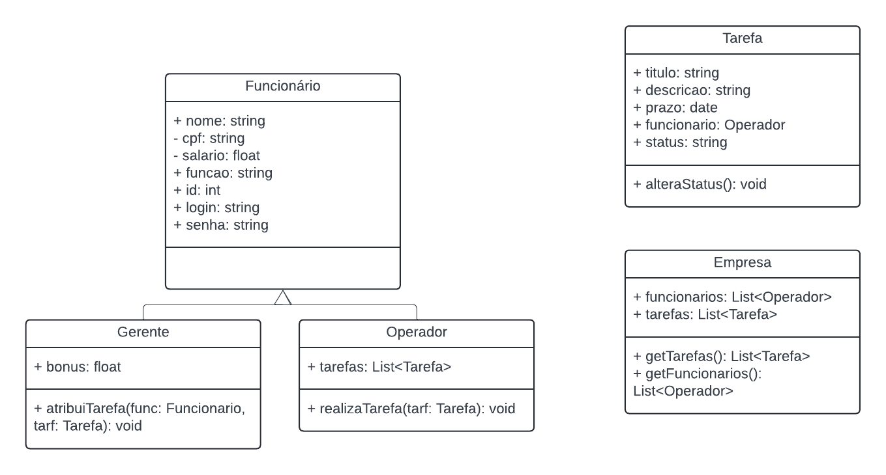
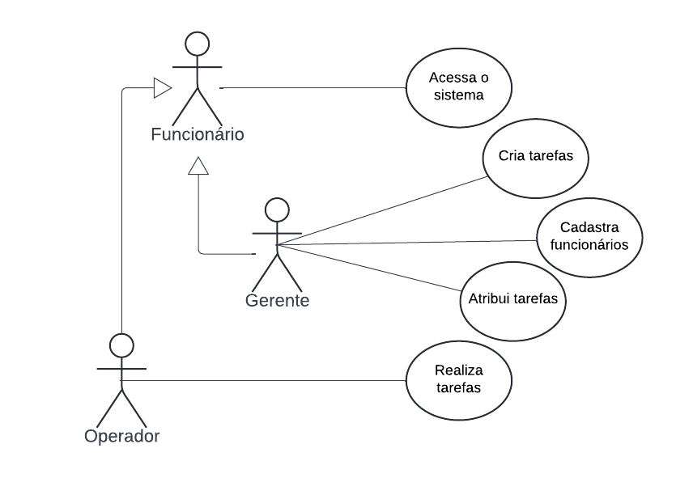

# APS - POO

## Participantes

- [Sarah](https://github.com/saroka11)
- [Laura](https://github.com/lauraTchaly)
- [João](https://github.com/JayfckZ)
- [Eduardo](https://github.com/Dudubzrj)

## Status do Projeto

- **Projeto**: Gerenciamento de tarefas para empresa
  
- **Diagramas**:
  - Finalizar diagrama de classes
  - Construir diagrama de casos de uso (feito)

- **Código**:
  - Finalizar classes (feito)
  - Implementar a lógica de operação
  - Desenvolver interfaces

### Diagramas

<figure>
  <figcaption>Diagrama de Classes</figcaption>
  
</figure>

<figure>
  <figcaption>Diagrama de Casos de Uso</figcaption>
  
</figure>
